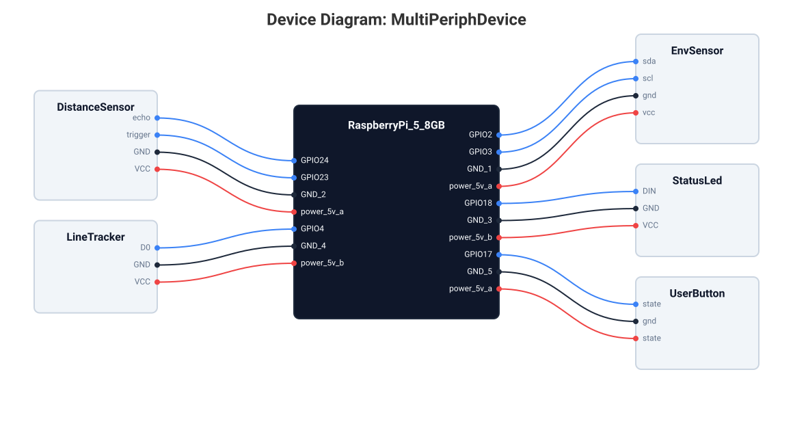

# DeMoL

## Hero

<div align="center">


**A textX-based DSL for declarative IoT device modeling with hardware-aware semantic
validation and reproducible code generation for Raspberry Pi (Python), RIOT (C), Zephyr (C),
Wokwi (diagram.json + wokwi.toml), and Renode (.repl + pyrenode3).**

[](https://github.com/robotics-4-all/demol/actions/workflows/ci.yml)

</div>

## The Problem

Research and prototyping workflows for IoT devices share a common set of bottlenecks.

Device code is rewritten per platform with no shared source of truth. The same sensor
logic takes different forms on Raspberry Pi, ESP32, and Arduino. Those implementations
drift apart over time, and porting a design to a new target means starting from scratch
or copying untested fragments from a sibling project. The absence of a single,
authoritative device description makes it impossible to verify that two implementations
for different platforms are functionally equivalent.

Pin assignments and protocol constraints are checked by hand, or not at all. An I2C
address collision, a voltage mismatch between board and peripheral, or a GPIO shared
across two outputs is typically caught at hardware bring-up, not during design. The
cost of a late-stage fix ranges from a board respin to a damaged component. Manual
inspection does not scale beyond a few peripherals.

Models are embedded in code spread across files. A hardware change -- swapping a
sensor, rewiring a bus, changing the power source -- means editing multiple source
files instead of updating a single declarative specification. There is no single
artifact that describes the device as a whole. The wiring logic, protocol
configuration, and pin assignments are scattered across initialization routines,
header files, and configuration dictionaries.

There is no formal grounding for what constitutes a valid IoT device. The language of
device design is informal, ad hoc, and varies across teams and projects.
Reproducibility suffers because the design lives only in the implementer's head.
Peer review of a device configuration is impossible without a shared, parseable
representation that captures both structure and constraints.

## DeMoL in One Sentence

DeMoL is a textX-based DSL that captures an IoT device as a single `.dev` model and
compiles it to validated, reproducible code for five target platforms: Raspberry Pi
(Python), RIOT OS (C), Zephyr RTOS (C), Wokwi (diagram.json + wokwi.toml), and
Renode (.repl + pyrenode3).

The `.dev` model serves as the authoritative specification: it describes the board,
its peripherals, the electrical connections, the communication brokers, the sampling
policies, the user-defined constraints, and the alert triggers. All generators read
this single file and produce platform-specific artifacts from it.

## How It Works


DeMoL follows a three-stage pipeline.

1. **Model** -- A designer writes a `.dev` file describing the board, peripherals,
   connections, communication brokers, sampling policies, constraints, and alerts.
   The syntax mirrors the hardware structure: boards, sensors, actuators, pins,
   protocols, and buses are all first-class citizens in the grammar. The file is
   self-contained and serves as the single source of truth for the device.

2. **Validate** -- The semantic engine checks 33+ hardware-aware rules across 16 validator classes: voltage
   compatibility, pin conflict detection, I2C address uniqueness, protocol frequency
   constraints, power budget limits, user-defined CONSTRAINT expressions, and ALERT
   trigger consistency. Validation errors are collected with precise line and column
   information and rendered with actionable hints. No code is generated for an
   invalid model. The validation pass is deterministic and reproducible.

3. **Generate** -- The validated model feeds platform-specific code generators. The
   RPi Python generator produces a commlib-based node with sensor initialization,
   MQTT publishing, and configurable sampling loops. The RIOT C generator produces
   bare-metal firmware with the same logical structure. The Zephyr C generator emits
   a buildable Zephyr application (CMakeLists.txt, prj.conf, devicetree overlay,
   Kconfig, and 18 driver ports covering the most common IoT peripherals). Both
   RIOT and Zephyr backends support CONSTRAINT runtime checks. Wokwi emits a
   `diagram.json` and `wokwi.toml` for the Wokwi simulator. Renode emits a `.repl`
   machine definition plus a pyrenode3 test script. Additional generators produce wiring
   diagrams (SVG), pin-mapping reports (MD + JSON), JSON model representations, and
   hardware construction guides.

## A Real Model

```demol
DEVICE MixedConnectionDevice WITH
    description="Device mixing manual CONNECT and SMARTCONNECT",
    os=raspbian;

USE RaspberryPi_5_8GB;
USE BME680[EnvSensor], HCSR04[DistanceSensor];

BROKER[MQTT] Broker WITH host="localhost", port=1883;

// Manual wiring -- full control over pin assignments
CONNECT EnvSensor WITH
    POWER gnd -- GND_1, vcc -- power_5v_a
    DATA i2c[slave_address=0x76] sda -- GPIO2, scl -- GPIO3
    @ "sensors/env";
```

A device model is a single text file. The full example adds a
`SMARTCONNECT DistanceSensor` block and lives at
[`examples/rpi/rpi_mixed_connect.dev`](examples/rpi/rpi_mixed_connect.dev).

The DSL syntax distinguishes between manual `CONNECT` blocks for precise wiring
control and `SMARTCONNECT` blocks for automatic pin assignment. The model also
supports `SAMPLING` blocks for data acquisition configuration, `CONSTRAINT` blocks
for user-defined invariants, and `ALERT` blocks for threshold-based triggers. Every
keyword in the language corresponds to a first-class concept in the metamodel.

## Show Me the Output

Running `demol generate rpi examples/rpi/rpi_mixed_connect.dev --output-dir ./output`
produces `envsensor_node.py` (69 lines). The class shell shows the generator's
structure: commlib imports, sensor initialization, and MQTT publisher wiring.

```python
from commlib.node import Node
from commlib.utils import get_timestamp_ns, Rate
from commlib.transports.mqtt import ConnectionParameters
from .msg import EnvMessage
from .bme680_envsensor import BME680_EnvSensor


class BME680Node:
    _FREQUENCY = 10.0
    _SAMPLING_MODE = "continuous"

    def __init__(self):
        self.sensor = BME680_EnvSensor()
        self.node = Node(node_name='sensors.env.envsensor',
                         connection_params=ConnectionParameters(
                             host="localhost", port=1883))
```

The RIOT C generator produces a structurally equivalent firmware in C with the same
pin configuration, protocol setup, and topic subscription logic. All generators
derive their output from the same validated `.dev` model, guaranteeing that the RPi
Python prototype, the RIOT C deployment, the Zephyr RTOS port, the Wokwi
simulation, and the Renode emulation all share the same hardware configuration.

The same model produces a wiring diagram and a pinmap report via
`demol generate svg` and `demol generate pinmap`.



A full list of all generator targets, their output formats, and usage examples is
in [`docs/backends.md`](docs/backends.md).

## Why Researchers Choose DeMoL


**Formal semantics** -- A 1,800-line mathematical specification in
[`docs/semantics.md`](docs/semantics.md) defines the device model,
voltage/pin/protocol constraints, and the validation engine using inference rules and
proof obligations. The specification covers the abstract syntax, static semantics,
type system, and dynamic semantics of every language construct, including SAMPLING
blocks, CONSTRAINT expressions, and ALERT triggers. This formal grounding supports
verification of model properties and opens a path toward theorem-prover integration
and model checking.

**Reproducible code generation** -- The same `.dev` model produces byte-identical RPi
Python, RIOT C, and Zephyr C outputs across runs and machines. The generators in
[`demol/transformations/m2t_rpi.py`](demol/transformations/m2t_rpi.py),
[`demol/transformations/m2t_riot.py`](demol/transformations/m2t_riot.py), and
[`demol/transformations/m2t_zephyr.py`](demol/transformations/m2t_zephyr.py) are
deterministic and tested against golden-file snapshots in the test suite at
[`tests/`](tests/). A model round-trip through validate and generate always produces
the same artifact set, which supports CI verification of generated code.

**33+ semantic validation rules** -- The validator suite in
[`demol/lang/semantics/validators/`](demol/lang/semantics/validators/) covers power
compatibility, pin conflicts, protocol frequency constraints, I2C address uniqueness,
user-defined CONSTRAINT expressions, ALERT trigger correctness, sampling policy
consistency, and multi-broker VIA routing. Running `demol validate` on a model
reports every applicable rule and its outcome with precise source locations. The
validator architecture is class-based and extensible: new rules inherit from
`BaseValidator` and register themselves automatically.

**Open hardware library** -- A library of 12 boards (Raspberry Pi, ESP32, ESP8266,
Arduino) and 32 sensors / 13 actuators / 2 power sources lives in
[`demol/builtin_models/`](demol/builtin_models/). Each entry is a validated `.hwd`
component model that the DSL resolves at parse time via the component metamodel. The
full catalog is documented in
[`docs/sensors-actuators.md`](docs/sensors-actuators.md), with interface type, bus
protocol, voltage range, and code-generation support status for each component.

## Hardware Library

The full hardware library (boards, sensors, actuators, power sources) is in
[`docs/sensors-actuators.md`](docs/sensors-actuators.md). Each entry is a validated
`.hwd` component model loaded at parse time.

## Backends

A single `.dev` model is the single source of truth for every backend. DeMoL ships
with five code generators, each producing a complete runnable artifact set for one
target platform or simulator. The CLI subcommand selects the backend; the model is
unchanged.

| Backend | Output | Target |
| --- | --- | --- |
| `rpi` | Python (commlib-py) | Raspberry Pi on Raspbian |
| `riot` | C firmware | RIOT OS on ESP32 / ESP8266 |
| `zephyr` | C firmware + devicetree | Zephyr RTOS on ESP32 / ESP8266 |
| `wokwi` | `diagram.json` + `wokwi.toml` | Wokwi web simulator |
| `renode` | `.repl` + pyrenode3 script | Renode hardware simulator |

All backends share the same validated model, the same pin assignments, the same
broker configuration, and the same topic wiring. The full reference for every
backend, including output structure, supported peripherals, and CLI flags, lives
in [`docs/backends.md`](docs/backends.md). The example gallery at
[`examples/README.md`](examples/README.md) lists every `.dev` model and the
backends it supports.

### Zephyr Backend

Generates a complete Zephyr application from the `.dev` model: a `CMakeLists.txt`,
`prj.conf`, a board-specific devicetree overlay, a static `main.c` skeleton, and
one driver source file per peripheral. The driver set covers 18 IoT peripherals
including BME280, BME680, BH1750, button, DS18B20, DHT22, HCSR04, HW006, LED,
MPL3115A2, PIR_HCSR501, relay, servo, ADS1115, SHTC3, SRF04, SRF05, and WS281X.
Supported targets include
`esp32_devkitc` (ESP32) and `esp8266` boards.

```sh
demol generate zephyr examples/esp/esp_bme680.dev --output-dir ./zephyr_out
```

The generator writes:

```
zephyr_out/
└── app/
    ├── CMakeLists.txt
    ├── prj.conf
    ├── boards/<board>.overlay
    └── src/
        ├── main.c
        └── <peripheral>.c   # one file per peripheral instance
```

Use `--board <name>` to override the inferred board. The full peripheral support
matrix and example invocations are in [`docs/backends.md`](docs/backends.md#zephyr).

### Wokwi Backend

Produces a [Wokwi](https://wokwi.com/) simulation project from the model. The
generator emits a `diagram.json` with one part entry per board, peripheral, and
power source, plus typed `connections` derived from the model's `CONNECT` blocks.
A `wokwi.toml` provides the net color palette. The model is mapped to standard
Wokwi part IDs (BME680, WS2812, HCSR04, TactileButton, etc.) and to Wokwi board
identifiers (`rpi-4b`, `wemos-d1-r32`, `esp32-devkit-c-v4`, `arduino-uno`, and
others).

```sh
demol generate wokwi examples/esp/esp_button_led.dev --output-dir ./wokwi_out
```

The generator writes:

```
wokwi_out/
├── diagram.json
└── wokwi.toml
```

Drop the contents into the Wokwi editor or push them to a GitHub repository
connected to a Wokwi project. The full peripheral support matrix is in
[`docs/backends.md`](docs/backends.md#wokwi).

### Renode Backend

Produces a [Renode](https://renode.io/) simulation harness from the model. The
generator writes a `.repl` platform description that maps the board's CPU, buses,
and peripheral devices onto Renode's `sysbus`, plus a `pyrenode3` Python test
script that boots the simulation, loads the application ELF, and asserts that
each declared peripheral is present at runtime. The Renode backend is
verification-oriented: it provides fast, headless integration tests for firmware
before it is flashed to real hardware.

```sh
demol generate renode examples/esp/esp_bme680.dev --output-dir ./renode_out
```

The generator writes:

```
renode_out/
├── device.repl
└── test_device.py
```

Use `--elf-path <path>` to point the test script at a pre-built application ELF.
Run the harness with `renode --disable-xwt test_device.py`. The full peripheral
support matrix is in [`docs/backends.md`](docs/backends.md#renode).

## DeMoL vs. Alternatives

| Approach | Declarative model | Semantic validation | Multi-target codegen |
| --- | --- | --- | --- |
| Raw Python (per platform) | no | none | one platform per codebase |
| Arduino sketch | partial (`.ino` + comments) | manual pin checks | one board per sketch |
| PlatformIO | partial (`platformio.ini`) | library-level only | C++/Arduino, MicroPython |

Other tools (Zephyr / Devicetree, raw textX) cover adjacent niches; this comparison
focuses on the most common prototyping path. DeMoL's combination of a formal semantic
specification, a declarative model format, and multi-target code generation is
distinctive among DSLs for IoT device design.

## Quick Start

```sh
pip install demol
demol validate examples/rpi/rpi_mixed_connect.dev
demol generate rpi examples/rpi/rpi_mixed_connect.dev --output-dir ./output
demol generate riot examples/esp/esp_iot_device.dev --output-dir ./output
demol generate zephyr examples/esp/esp_iot_device.dev --output-dir ./output
demol generate wokwi examples/esp/esp_iot_device.dev --output-dir ./output
demol generate renode examples/esp/esp_iot_device.dev --output-dir ./output
demol generate svg examples/rpi/rpi_mixed_connect.dev --output-dir ./output
```

Generated code and reports land in the directory passed to `--output-dir`. See
[`docs/backends.md`](docs/backends.md) for all codegen options including RPi Python,
RIOT C, Zephyr C (with devicetree + Kconfig), Wokwi (diagram.json + wokwi.toml),
Renode (.repl + pyrenode3), SVG wiring diagrams, pin-mapping reports (MD + JSON),
JSON output, and SMAuto automation models. The
[`examples/README.md`](examples/README.md) shows generated output for every
backend.

The CLI also supports `demol analyze power` for battery runtime estimation,
`demol fix` for auto-correcting common validation errors, and `demol diff` for
semantic comparison of two model files.

## Citing DeMoL in Research

<!-- TODO(citation): replace this placeholder with the citable key once available.
Format: BibTeX entry + one-line citation hint. -->

A formal citation will be added here once a published artifact is available; in the
meantime, please cite the GitHub release at
<https://github.com/robotics-4-all/demol/releases>.

DeMoL's design is grounded in a formal semantic specification covering the device
model, voltage/pin/protocol constraints, and the validation engine. The full 1,800-line
mathematical specification is in [`docs/semantics.md`](docs/semantics.md), with
inference rules and proof obligations for the 33+ validation checks. The semantics
document uses mathematical notation for voltage domains, pin functions, protocol
constraints, power budgets, sampling configurations, and alert trigger conditions.

## Documentation & Resources

| Document | Description |
| --- | --- |
| [Language Reference](docs/language-reference.md) | Grammar, syntax, hardware components, connections, brokers |
| [Semantic Validation](docs/semantic-validation.md) | Validation rules, safety checks, error examples |
| [Code Generation & CLI](docs/code-generation.md) | Generators, CLI usage, deployment artifacts, diagrams |
| [Backend Reference](docs/backends.md) | Per-backend reference for RPi, RIOT, Zephyr, Wokwi, Renode |
| [Formal Semantics](docs/semantics.md) | Mathematical specification of the language |
| [Sensors & Actuators](docs/sensors-actuators.md) | Hardware library reference |
| [Testing](docs/testing.md) | Test suite structure and coverage |
| [Example Gallery](examples/README.md) | Generated output for every backend |
| [CONSTRAINT Design](docs/constraint-runtime-design.md) | CONSTRAINT runtime architecture for RPi, RIOT, Zephyr |
| [Broker Codegen Audit](docs/broker-codegen-audit.md) | AMQP/Redis broker support architecture |

## License & Community

DeMoL is released under the [MIT License](LICENSE). Copyright (c) 2023
robotics-4-all. Maintainer: Konstantinos Panayiotou
(<klpanagi@gmail.com>). Issues and pull requests are tracked on GitHub.
