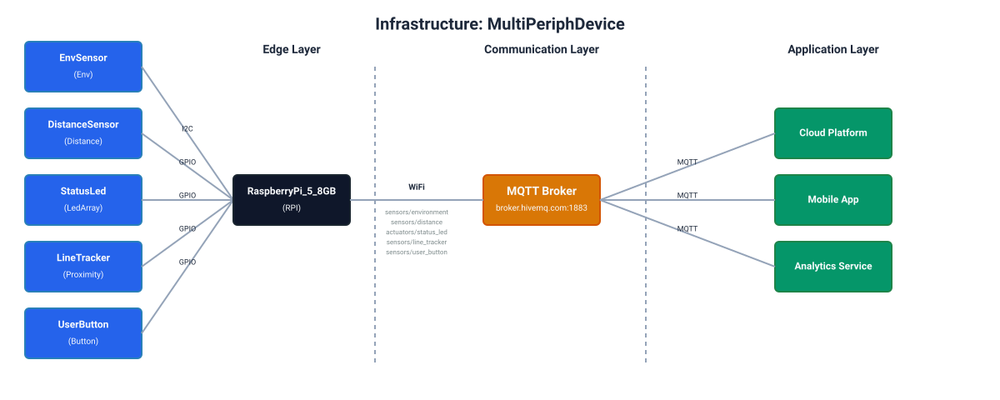

<div id="top">

<!-- HEADER STYLE: CLASSIC -->
<div align="center">


<em></em>

<!-- BADGES -->
<!-- local repository, no metadata badges. -->

<em>Built with the tools and technologies:</em>


<br>


</div>
<br>

---

# DeMoL - A DSL for modeling IoT Devices

## 📜 Table of Contents

- [DeMoL - A DSL for modeling IoT Devices](#demol---a-dsl-for-modeling-iot-devices)
  - [📜 Table of Contents](#-table-of-contents)
  - [📖 Overview](#-overview)
  - [👾 Features](#-features)
  - [🚀 Getting Started](#-getting-started)
    - [🔖 Prerequisites](#-prerequisites)
    - [🛠️ Installation](#️-installation)
      - [Install from source](#install-from-source)
  - [📚 Language Reference](#-language-reference)
    - [Grammar Structure](#grammar-structure)
    - [Core Concepts](#core-concepts)
    - [Device Model Structure](#device-model-structure)
      - [Device Configuration](#device-configuration)
      - [Network Configuration](#network-configuration)
      - [Hardware Components](#hardware-components)
      - [Attributes in Components](#attributes-in-components)
    - [Hardware Components](#hardware-components-1)
      - [Board Models](#board-models)
      - [Peripheral Models (Sensors)](#peripheral-models-sensors)
      - [Peripheral Models (Actuators)](#peripheral-models-actuators)
    - [Connections](#connections)
      - [GPIO Connection](#gpio-connection)
      - [I2C Connection](#i2c-connection)
      - [SPI Connection](#spi-connection)
      - [UART Connection](#uart-connection)
      - [Remote Topics](#remote-topics)
    - [Message Brokers](#message-brokers)
      - [MQTT Broker](#mqtt-broker)
      - [AMQP Broker](#amqp-broker)
      - [Redis Broker](#redis-broker)
    - [Complete Example](#complete-example)
  - [🔌 Supported Sensors \& Actuators](#-supported-sensors--actuators)
    - [Sensor Categories](#sensor-categories)
    - [Actuator Categories](#actuator-categories)
    - [Message Schemas](#message-schemas)
  - [📐 Formal Semantics](#-formal-semantics)
  - [🔍 Semantic Validations](#-semantic-validations)
    - [Validation Categories](#validation-categories)
      - [1. **Power Connection Validation**](#1-power-connection-validation)
      - [2. **IO Connection Validation**](#2-io-connection-validation)
      - [3. **Safety Properties**](#3-safety-properties)
      - [4. **Well-Formedness Rules**](#4-well-formedness-rules)
    - [Validation Workflow](#validation-workflow)
    - [Running Validations](#running-validations)
    - [Validation Output](#validation-output)
    - [Implementation](#implementation)
  - [🔧 Usage](#-usage)
    - [Code Generation](#code-generation)
      - [Architecture](#architecture)
      - [Supported Generators](#supported-generators)
      - [Running Code Generation](#running-code-generation)
    - [Documentation & Diagram Generation](#documentation--diagram-generation)
    - [REST API](#rest-api)
      - [`POST /validate`](#post-validate)
      - [`POST /generate`](#post-generate)
  - [📜 License](#-license)
  - [🎩 Acknowledgments](#-acknowledgments)
  - [🌟 Star History](#-star-history)

## 📖 Overview

**Device Modeling Language (DeMoL)** is a domain-specific language (DSL) designed for the automated synthesis of Internet of Things (IoT) device open-source software, in a hardware-aware manner. It provides a high-level, declarative abstraction for defining hardware configurations, peripheral interconnections, and communication protocols, decoupling the device logic from the underlying platform implementation.

DeMoL employs a model-driven engineering (MDE) approach to facilitate the generation of platform-specific code (e.g., Python for Raspberry Pi, C for RiotOS) from platform-independent models. By enforcing rigorous semantic validation rules—including electrical compatibility checks, pin conflict detection, and protocol constraints—DeMoL ensures the correctness and safety of the synthesized artifacts, thereby reducing development complexity and mitigating hardware-level errors in IoT system design.


## 👾 Features

|      |        Feature        | Summary                                                                                                                                                                                                                                                                     |
| :--- | :-------------------: | :-------------------------------------------------------------------------------------------------------------------------------------------------------------------------------------------------------------------------------------------------------------------------- |
| 🔌    | **Hardware-Aware**    | <ul><li>Explicit modeling of board specifications (pins, voltages, frequencies)</li><li>Peripheral component definitions (sensors, actuators)</li><li>Electrical compatibility checks (voltage levels, power constraints)</li></ul>                                         |
| 🛡️    | **Semantic Safety**   | <ul><li>Rigorous validation of pin configurations and conflicts</li><li>Protocol constraint enforcement (I2C addresses, UART baudrates)</li><li>Prevention of short-circuits and invalid connections</li></ul>                                                              |
| �    | **Automated Synthesis**| <ul><li>Generation of platform-specific code (Python/RiotOS) from abstract models</li><li>Automatic boilerplate generation for communication and hardware initialization</li><li>Consistent and error-free implementation artifacts</li></ul>                               |
| 🌐    | **Protocol-Agnostic** | <ul><li>Abstract definition of communication logic</li><li>Seamless switching between MQTT, AMQP, and Redis brokers</li><li>Decoupled application logic from transport implementation</li></ul>                                                                             |
| 🧩    | **Declarative Design**| <ul><li>High-level syntax for defining device composition</li><li>Separation of concerns between hardware, logic, and communication</li><li>Model-Driven Engineering (MDE) principles</li></ul>                                                                             |

---

## 🚀 Getting Started

### 🔖 Prerequisites

This project requires the following dependencies:

- **Programming Language:** Python 3.7+
- **Packages:** textX, jinja2
- **Package Manager:** Pip

### 🛠️ Installation

Download this repository and either use the CLI and the API of the DSL directly from source, or in docker container.

#### Install from source

1. Pull this repository locally

```sh
git clone https://github.com/robotics-4-all/demol.git
```

2. Create a Virtual environment (Optional Step)

```sh
python -m venv venv && source ./venv/bin/activate
```

3. Install the DSL package in `develop` mode

```sh
pip install -e .
```


## 📚 Language Reference

The DeMoL DSL is built using the [textX](http://textx.github.io/textX/) framework and provides a declarative approach to modeling IoT devices.

### Grammar Structure

The grammar is modular and split into **4 interconnected files** located in `demol/grammar/`:

| File               | Purpose                           | Key Concepts                        |
| ------------------ | --------------------------------- | ----------------------------------- |
| `device.tx`        | Main device model definition      | DeviceModel, Connect                |
| `component.tx`     | Board & peripheral hardware specs | Board, Sensor, Actuator, Pins       |
| `communication.tx` | Message broker configurations     | AMQPBroker, MQTTBroker, RedisBroker |
| `common.tx`        | Common utilities & types          | AttributeSet, VALUE, Imports        |

### Core Concepts

The language is built around these fundamental concepts:

- **Device** - Complete IoT device definition with metadata and configuration
- **Board** - Microcontroller/SBC hardware (ESP32, Raspberry Pi, etc.)
- **Peripheral** - External sensors and actuators (BME680, SRF04, etc.)
- **Connect** - Defines how peripherals connect to boards (power + data + remote)
- **MessageBroker** - Communication infrastructure (MQTT, AMQP, Redis)
- **Network** - WiFi configuration

**File Extensions:**
- `.dev` - Device models (complete IoT device definitions)
- `.hwd` - Hardware component models (boards and peripherals)

### Device Model Structure

Every `.dev` file follows this structure:

```
DEVICE DeviceName WITH description="Device description", author="author_name", os=raspbian;

NETWORK[WiFi] WITH ssid="WiFi_SSID", password="password";

BROKER[MQTT] BrokerName WITH host="mqtt.example.com", port=1883, auth.username="user", auth.password="pass";

USE BoardModelName;
USE PeripheralModel1(InstanceName1), PeripheralModel2(InstanceName2);

CONNECT InstanceName1 WITH
    POWER
        board_pin -- peripheral_pin,
        board_pin2 -- peripheral_pin2
    DATA
        gpio[mode="output"] board_pin -- peripheral_pin
    @ "device/sensor/topic";
```

#### Device Configuration

Describes the device and target platform using the `DEVICE` statement:

```
DEVICE SmartSensor WITH description="Environmental monitoring sensor", author="developer_name", os=raspbian;
```

**Target Operating Systems:**
- `raspbian` - For Raspberry Pi devices
- `riotos` - For embedded systems (ESP32, ESP8266, etc.)
- `freertos`, `arduino`, `esp-idf`, `esp-idf-rtos` - Other embedded platforms

#### Network Configuration

WiFi network settings using the `NETWORK` statement:

```
NETWORK[WiFi] WITH ssid="IoT_Network", password="secure_password";
```

#### Hardware Components

Specifies the hardware composition using `USE` statements:

```
USE RaspberryPi_4B_4GB;
USE BME680(EnvSensor) [poll_period = 5], SonarSRF04(DistanceSensor);
USE WS2812(StatusLED);
```

**Features:**
- `USE <BoardName>;` defines the main board.
- `USE <Peripheral>(<Name>);` defines peripherals.
- Board references are resolved from the global repository in `demol/builtin_models/boards/`
- Peripheral models are loaded from `demol/builtin_models/peripherals/`
- Supports multi-file imports using FQN (Fully Qualified Names)
- Named peripheral instances for easy reference in connections
- **Attributes can be overridden** using square bracket syntax

#### Attributes in Components

Peripheral attributes can be customized when declaring instances:

```
USE BME680(EnvSensor) [
    poll_period = 5,
    filter_size = 7
];

USE SonarSRF04(DistanceSensor) [
    max_distance = 300
];
```

**Key Points:**
- Attributes override peripheral default values
- Use square brackets `[ ]` after the instance name
- Comma-separated attribute assignments within square brackets
- Comma-separated peripheral instances in the peripherals list
- Only override attributes you need to change
- Supports lists and dictionaries: `colors = ['0xFF0000', '0x00FF00']` or `config = {timeout = 5000}`

### Hardware Components

#### Board Models

Boards are defined in `.hwd` files and describe microcontroller/SBC specifications using the `Board[Type] name` syntax:

```
BOARD[RPI] RaspberryPi_4B_4GB WITH
    OP
        vcc=5V,
        ioVcc=3V3,
        energy=1.4 W, 7.6 W, 3.5 W,  // min, max, avg power consumption
        memory.flash=16 gb,
        memory.ram=4 gb,
        cpu.family=PiArmCortex,
        cpu.freq=1500 mhz,
        cpu.fpu=true,
        wifi.name=RPi4_WiFi,
        wifi.version=5,
        wifi.bands=[2.4GHz, 5GHz],
        bluetooth=BT5
    PORTS
        spi=2,
        i2c=2,
        uart=2,
        gpio=28
    PINS
        power_5v[5V] @ 2,
        gnd_1[GND] @ 6,
        p_21[gpio,sda-1] @ 40,
        p_22[gpio,scl-1] @ 38
;
```

**Board Types:** `RPI` (Raspberry Pi), `ESP` (ESP32/ESP8266), `ARDUINO`

**Pin Syntax:**
- `name [type] @ number` - Power pins (VCC, GND)
- `name [funcs] @ number` - Digital/IO pins with functions

**Pin Functions:** `gpio`, `adc`, `dac`, `pwm-<channel>`, `sda-<bus>`, `scl-<bus>`, `mosi-<bus>`, `miso-<bus>`, `sck-<bus>`, `cs-<bus>`, `tx-<bus>`, `rx-<bus>`

**Power Types:** `GND`, `3V3`, `5V`, `12V`

#### Peripheral Models (Sensors)

Sensors use the `Sensor[Type] name` syntax where Type indicates the sensor category and its message schema:

```
SENSOR[Env] BME680 WITH
    OP
        vcc=5V,
        ioVcc=3V3,
        energy=0.01 mW, 39.6 mW, 3 mW  // min, max, avg power consumption
    PINS
        vcc[5V] @ 1,
        gnd[GND] @ 5,
        sda[sda-0] @ 2,
        scl[scl-0] @ 3
    TEMPLATES
        raspbian="bme680.py.tmpl",
        riotos="bme680.c.tmpl"
    ATTRIBUTES
        poll_period[int] = 10,
        humidity_oversample[int] = 2,
        temperature_oversample[int] = 8,
        filter_size[int] = 3
;
```

**Available Sensor Types:** `Distance`, `Temperature`, `Humidity`, `Gas`, `Env`, `AirQuality`, `Light`, `UV`, `Sound`, `Acceleration`, `Gyroscope`, `Magnetometer`, `IMU`, `Tracker`, `Proximity`, `Motion`, `Presence`, `ADC`, `Current`, `Voltage`, `Power`, `Flow`, `Level`, `Weight`, `Force`, `Vibration`, `Camera`, `RFID`, `Fingerprint`, `GPS`, `Color`

For complete sensor type documentation and message schemas, see **[SENSORS_ACTUATORS.md](SENSORS_ACTUATORS.md)**.

#### Peripheral Models (Actuators)

Actuators use the `Actuator[Type] name` syntax:

```
ACTUATOR[ServoController] PCA9685 WITH
    OP
        vcc=5V,
        ioVcc=5V
    PINS
        GND_1[GND] @ 1,
        SCL_1[scl-0] @ 2,
        SDA_1[sda-0] @ 3,
        VCC_1[5V] @ 4
    ATTRIBUTES
        num_servos[int] = 16,
        frequency[int] = 50
;
```

**Available Actuator Types:** `MotorController`, `ServoController`, `Relay`, `Switch`, `Led`, `LedArray`, `NeoPixel`, `Display`, `LCD`, `OLED`, `Buzzer`, `Speaker`, `Stepper`, `DCMotor`, `Pump`, `Valve`, `Heater`, `Cooler`, `Fan`

For complete actuator type documentation and command schemas, see **[SENSORS_ACTUATORS.md](SENSORS_ACTUATORS.md)**.

**Units:**
- **Memory:** `b`, `kb`, `mb`, `gb`
- **Frequency:** `hz`, `khz`, `mhz`, `ghz`
- **Distance:** `mm`, `cm`, `m`
- **Power:** `uW`, `mW`, `W`

### Connections

Connections define how peripherals connect to the board through power and IO pins:

#### GPIO Connection

```
CONNECT DistanceSensor WITH
    POWER
        gnd_1 -- gnd,
        power_5v -- vcc
    DATA
        gpio[mode="output"] p_13 -- trigger,
        gpio[mode="input"] p_14 -- echo
    @ "sensors/distance";
```

#### I2C Connection

```
CONNECT EnvSensor WITH
    POWER
        gnd_1 -- GND,
        power_5v -- VCC
    DATA
        i2c[slave_address=0x76] sda p_21 -- sda, scl p_22 -- scl
    @ "sensors/environment";
```

#### SPI Connection

```
CONNECT DisplayModule WITH
    POWER
        gnd_1 -- GND,
        power_3v3 -- VCC
    DATA
        spi[bus_speed=1000000, mode=0] mosi p_23 -- mosi, miso p_19 -- miso, sck p_18 -- sck, cs p_5 -- cs;
```

#### UART Connection

```
CONNECT GPSModule WITH
    POWER
        gnd_1 -- GND,
        power_5v -- VCC
    DATA
        uart[baudrate=115200] tx p_1 -- RXD, rx p_3 -- TXD
    @ "sensors/gps";
```

**Note:** UART connections require TX→RX and RX→TX crossover (board TX connects to peripheral RX, and vice versa).

#### Remote Topics

The `@` symbol in connections specifies the MQTT/AMQP/Redis topic for this peripheral:

```
CONNECT MySensor WITH
    POWER ...
    DATA ...
    @ "device/sensor/data";  // optional
```

**Auto-generated Topics:** If `@` is omitted, topics may be auto-generated based on device and peripheral names.


### Message Brokers

DeMoL supports three message broker types:

#### MQTT Broker

```
BROKER[MQTT] MyMqttBroker WITH
    host="mqtt.example.com",
    port=1883,
    ssl=False,
    basePath="/mqtt",  // optional
    webPath="/ws",  // optional
    webPort=8080,  // optional
    auth.username="sensor_client",
    auth.password="secure_pass";
```

#### AMQP Broker

```
BROKER[AMQP] MyAmqpBroker WITH
    host="rabbitmq.example.com",
    port=5672,
    vhost="/",  // optional
    topicExchange="amq.topic",  // optional
    rpcExchange="amq.rpc",  // optional
    ssl=False,
    auth.username="guest",
    auth.password="guest";
```

#### Redis Broker

```
BROKER[Redis] MyRedisBroker WITH
    host="redis.example.com",
    port=6379,
    db=0,  // optional
    ssl=False,
    auth.username="default",
    auth.password="redis_pass";
```

**Authentication Methods:**
- **Username/Password:** `auth.username="user", auth.password="pass"`
- **API Key:** `auth.key="api_key_value"`

### Complete Example

Here's a comprehensive device model demonstrating multiple peripherals, network configuration, and remote communication:

```
DEVICE MultiPeriphDevice WITH 
    description="A complex Raspberry Pi 5 system with multiple sensors and actuators", 
    author="Antigravity", 
    os=raspbian;

USE RaspberryPi_5_8GB;

USE BME680(EnvSensor), 
    SRF05(DistanceSensor), 
    WS2812(StatusLed), 
    TCRT5000(LineTracker),
    TactileButton(UserButton);

NETWORK[WiFi] WITH 
    ssid="MyHomeWiFi", 
    password="securepassword";

BROKER[MQTT] MyBroker WITH 
    host="broker.hivemq.com", 
    port=1883,
    auth.username="myuser",
    auth.password="mypassword";

// Environmental Sensor (I2C)
CONNECT EnvSensor WITH
    POWER 
        GND_1 -- gnd, 
        power_5v_a -- vcc
    DATA 
        i2c[slave_address=0x76] sda GPIO2 -- sda, scl GPIO3 -- scl
    @ "sensors/environment";

// Ultrasonic Distance Sensor (GPIO)
CONNECT DistanceSensor WITH
    POWER 
        GND_2 -- GND, 
        power_5v_a -- VCC
    DATA 
        gpio[mode="input"] GPIO24 -- echo, 
        gpio[mode="output"] GPIO23 -- trigger
    @ "sensors/distance";

// RGB LED Ring (GPIO)
CONNECT StatusLed WITH
    POWER 
        GND_3 -- GND, 
        power_5v_b -- VCC
    DATA 
        gpio[mode="output"] GPIO18 -- DIN
    @ "actuators/status_led";

// Line Tracker (GPIO)
CONNECT LineTracker WITH
    POWER 
        GND_4 -- GND, 
        power_5v_b -- VCC
    DATA 
        gpio[mode="input"] GPIO4 -- D0
    @ "sensors/line_tracker";

// User Input Button (GPIO)
CONNECT UserButton WITH
    POWER 
        GND_5 -- gnd, 
        power_5v_a -- state
    DATA 
        gpio[mode="input", pullup=true] GPIO17 -- state
    @ "sensors/user_button";
```


## 🔌 Supported Sensors & Actuators

DeMoL supports **35 sensor types** and **23 actuator types** covering a wide range of IoT applications:

### Sensor Categories

- **Environmental**: Temperature, Humidity, Pressure, Gas, Env, AirQuality, Light, UV, Sound
- **Motion & Position**: Distance, Proximity, Motion, Presence, Acceleration, Gyroscope, Magnetometer, IMU, Tracker
- **Specialized**: ADC, Current, Voltage, Power, Flow, Level, Weight, Force, Vibration
- **Smart**: Camera, RFID, Fingerprint, GPS, Color

### Actuator Categories

- **Basic**: MotorController, ServoController, Relay, Switch
- **Display & Light**: Led, LedArray, NeoPixel, Display, LCD, OLED
- **Sound**: Buzzer, Speaker
- **Advanced**: Stepper, DCMotor, Pump, Valve, Heater, Cooler, Fan

### Message Schemas

Each sensor and actuator type has a defined message schema for standardized communication:

**Example Sensor Message (Environmental):**
```json
{
  "temperature": 23.5,
  "humidity": 65.2,
  "pressure": 1013.25,
  "gas": 450.0,
  "timestamp": 1638360000000
}
```

**Example Actuator Command (NeoPixel):**
```json
{
  "leds": [
    {"index": 0, "r": 255, "g": 0, "b": 0},
    {"index": 1, "r": 0, "g": 255, "b": 0}
  ],
  "brightness": 128,
  "mode": "static",
  "timestamp": 1638360000000
}
```

For complete documentation of all sensor and actuator types with their message schemas, see **[SENSORS_ACTUATORS.md](SENSORS_ACTUATORS.md)**.


## 📐 Formal Semantics

For a complete formal specification of the DeMoL language, see **[SEMANTICS.md](SEMANTICS.md)**, which provides:

- **Abstract Syntax**: Mathematical representation of DeMoL constructs using syntactic domains and abstract syntax trees
- **Formal Grammar**: Complete EBNF specification of the concrete syntax
- **Static Semantics**: Well-formedness rules, type checking, and validation using inference rules
- **Operational Semantics**: Runtime behavior defined via small-step transition systems covering device initialization, broker connections, GPIO/I2C/SPI/UART operations, and message passing
- **Axiomatic Semantics**: Hoare logic specifications with pre/post conditions and invariants for device operations
- **Type System**: Complete type judgments, typing rules, and subtyping relations
- **Verification Conditions**: Safety properties (no short-circuits, voltage limits), liveness properties (message delivery, sensor readings), and correctness conditions

This formal foundation enables rigorous reasoning about device models, verified code generation, and static analysis tools.

## 🔍 Semantic Validations

DeMoL implements comprehensive semantic validations based on the formal semantics defined in [SEMANTICS.md](SEMANTICS.md). These validations ensure device models are well-formed, safe, and correct before code generation.

### Validation Categories

#### 1. **Power Connection Validation**

Ensures electrical compatibility between board and peripheral power connections:

- **Voltage Compatibility**: Power pins must have compatible voltages (within 0.5V tolerance)
- **GND Connections**: Both pins must be GND when connecting ground
- **VCC Connections**: Non-GND voltages must match peripheral requirements
- **Voltage Limits**: Power supplied must not exceed peripheral's maximum rated voltage

**Example Error:**
```
[Conn-Power] Incompatible power connection: board pin power_5v (5.0V) cannot 
connect to peripheral pin vcc (3.3V). Voltage difference exceeds 0.5V tolerance.
```

#### 2. **IO Connection Validation**

Validates pin functionality and protocol-specific requirements:

**GPIO Connections:**
- Both pins must have GPIO functionality
- Valid properties: `mode` (input/output), `pullup`, `pulldown`
- Mode must be either 'input' or 'output'

**I2C Connections:**
- Board and peripheral pins must have SDA/SCL functionality
- Slave address must be in range 0x00-0x7F
- Valid properties: `slave_address`, `bus_speed`
- All I2C addresses on the same bus must be unique

**SPI Connections:**
- All required pins (MOSI, MISO, SCK, CS) must have SPI functionality
- Valid properties: `bus_speed`, `mode` (0-3)

**UART Connections:**
- TX/RX pins must have proper UART functionality
- Board TX connects to Peripheral RX (and vice versa)
- Baudrate must be a common value (9600, 115200, etc.)
- Valid properties: `baudrate`, `parity`, `stop_bits`, `data_bits`

**Example Errors:**
```
[Conn-GPIO] Board pin GPIO5 does not have GPIO functionality.

[Conn-I2C] I2C slave address 0x80 out of valid range [0x00-0x7F]

[Conn-UART] Board pin TX connects to Peripheral TX. UART requires 
connecting Board TX to Peripheral RX.
```

#### 3. **Safety Properties**

Critical safety validations to prevent hardware damage:

**Pin Conflict Detection:**
- Each board pin can only be used once (except I2C and power pins)
- I2C pins (SDA/SCL) can be shared (bus architecture)
- Power pins (GND/VCC) can be shared (common nets)

**IO Voltage Compatibility:**
- Board IO voltage must match peripheral IO voltage
- Prevents communication errors and potential damage
- Emits warnings for voltage mismatches

**Common Ground Validation:**
- Each peripheral should have at least one GND connection
- Ensures proper electrical reference and signal integrity
- Emits warnings when ground connection is missing

**Example Errors:**
```
[Safety-Pin-Conflicts] Pin conflict detected: Board pin 'GPIO4' is already 
used by peripheral 'Sensor1' as 'GPIO'. Cannot reuse for peripheral 'Sensor2'.

[Safety-I2C-Address] I2C address conflict: Address 0x76 is already used by 
peripheral(s): BME680. Cannot reuse for peripheral 'TempSensor'.

[Safety-IO-Voltage] IO Voltage Incompatibility: Board 'RaspberryPi_5_8GB' 
operates at 5.0V (IO), but peripheral 'BME680' operates at 3.3V (IO).
```

#### 4. **Well-Formedness Rules**

Structural validations ensuring model completeness:

- **All Peripherals Connected**: Every peripheral must have at least one connection
- **Unique Peripheral Names**: All peripheral instances must have unique names
- **Unique Pin Numbers**: Pin numbers must be unique within each component
- **Broker Requirements**: Broker must be configured if remote endpoints are used
- **Pin Existence**: All referenced pins must exist in component definitions

**Example Errors:**
```
[WF-All-Peripherals-Connected] Unconnected peripherals detected: DistanceSensor. 
All peripherals must have at least one connection defined.

[WF-Unique-Peripheral-Names] Duplicate peripheral name 'MySensor'. Peripheral 
names must be unique within the device.

[WF-Unique-Pin-Numbers] Duplicate pin number 4 used by pins: GPIO4, SDA1. Pin 
numbers must be unique within a component.
```

### Validation Workflow

1. **Syntax Validation**: textX parser validates grammar compliance
2. **Semantic Validation**: Custom validators check:
   - Power connection compatibility
   - IO connection functionality
   - Safety properties (pin conflicts, voltage limits)
   - Well-formedness rules
3. **Warning Generation**: Non-critical issues emit warnings:
   - IO voltage incompatibility
   - Missing ground connections
   - Unusual baudrates

### Running Validations

**Validate a single model:**
```sh
demol validate examples/rpi_iot_device.dev
```

**Validate all examples:**
```sh
python scripts/validate_examples.py
```

**Validate builtin hardware models:**
```sh
python scripts/validate_builtin_models.py
```

### Validation Output

**Successful validation:**
```
[*] Processing model: examples/rpi_iot_device.dev
[✓] All validation checks passed!
```

**Validation with warnings:**
```
[*] Processing model: examples/esp_iot_device.dev
⚠ [Safety-IO-Voltage] IO Voltage Incompatibility at examples/esp_iot_device.dev:26
[✓] Validation passed with warnings
```

**Validation failure:**
```
[*] Processing model: examples/invalid_device.dev
✗ [Conn-Power] Incompatible power connection: board pin power_5v (5.0V) 
  cannot connect to peripheral pin vcc (3.3V)
```

### Implementation

All semantic validations are implemented in `demol/lang/semantics.py` based on the formal semantics specification. The validation system uses:

- **Type checking** for pin functionality verification
- **Constraint validation** for safety properties
- **Well-formedness rules** for structural correctness
- **Location tracking** for precise error reporting

For the complete formal specification of validation rules, see [SEMANTICS.md](SEMANTICS.md) sections 4 (Well-Formedness), 7 (Type System), and 8 (Verification Conditions).

## 🔧 Usage


The DSL provides a command-line interface (CLI) for operating on models.

```sh
venv [I] ➜ demol --help
Usage: demol [OPTIONS] COMMAND [ARGS]...

  An example CLI for interfacing with a document

Options:
  --help  Show this message and exit.

Commands:
  gen
  validate

```

The `gen` command allows you to execute Model-to-Text (M2T) transformations to generate code, documentation, or diagrams.

**Usage:**
```sh
demol gen [GENERATOR] [MODEL_FILE]
```

**Available Generators:**
- `svg`: Generates a professional schematic SVG diagram of the device connections.
- `infrastructure`: Generates a high-level infrastructure diagram showing the Edge, Communication, and Application layers.
- `docs`: Generates a comprehensive Markdown hardware construction guide including both diagrams.
- `pi`: Generates Python code for Raspberry Pi (using RPi.GPIO).
- `riot`: Generates C code for RiotOS (using RIOT-OS).

**Example - Generate SVG Diagram:**
```sh
demol gen svg examples/rpi_iot_device.dev
```
This command will generate an SVG file (e.g., `SmartEnvironmentMonitor.svg`) in the current directory, visualizing the pin-level connections between the board and peripherals.

The `validate` command is used to validate input models.
To validate a device model, for example the `./examples/raspi_iot_device.dev`, head to the `examples` directory and execute:

```sh
demol validate examples/rpi/multi_periph.dev
```

You should see an output similar to the below, in case of successful validation of the model.

```sh
[*] Running validation for model examples/rpi/multi_periph.dev
[✓] Validation passed!
```

Otherwise, the parser will raise an error:

```sh
textx.exceptions.TextXSemanticError: rpi_iot_device.dev:29:17: Unknown object "MyBME2" of class "PeripheralDef"
```

### Code Generation

DeMoL supports automated code generation for multiple platforms using a model-driven architecture.

#### Architecture


The code generation system uses an abstract `BaseCodeGenerator` class that provides common model querying capabilities. Platform-specific generators inherit from this base class to implement target-specific logic.

```
Device Model → BaseCodeGenerator (abstract)
                    ↓
            ┌───────┴────────┐
            ↓                ↓
    RPiCodeGenerator    ESPCodeGenerator (future)
            ↓                ↓
        Templates        Templates
```

#### Supported Generators

- **Raspberry Pi (Python)**: Generates Python code using `RPi.GPIO`, `smbus2`, and `spidev`.
- **RiotOS (C)**: (In development) Generates C code for RiotOS-supported boards.

#### Running Code Generation

To generate code for a device model:

```sh
# Generate Raspberry Pi code
demol generate rpi examples/rpi/multi_periph.dev
```

This will:
1. Parse the device model
2. Validate semantics
3. Resolve platform-specific templates
4. Generate the runtime software for the device

### Documentation & Diagram Generation

DeMoL can automatically generate hardware construction guides and infrastructure diagrams to help with the physical assembly and system architecture visualization.

#### 1. Hardware Construction Guide
Generates a Markdown file with BOM, wiring tables, and communication details.

```sh
demol generate docs examples/rpi/multi_periph.dev
```

#### 2. System Diagram (Wiring)
Generates a professional SVG showing pin-to-pin connections.

```sh
demol generate svg examples/rpi/multi_periph.dev
```

**Output Example:**


#### 3. Infrastructure Diagram
Generates an SVG visualizing the Edge, Communication, and Application layers.

```sh
demol generate svg examples/rpi/multi_periph.dev --infrastructure
```

**Output Example:**


### REST API

The DeMoL API provides REST endpoints for validating models and generating code. The API is secured with API keys.

**Authentication**

All API requests must include a valid API key in the `X-API-Key` header.

**Endpoints**

#### `POST /validate`

Validates a DeMoL model file (`.dev` or `.hwd`).

-   **Request:** `multipart/form-data`
    -   `file`: The model file to validate.
-   **Example Request:**
    ```bash
    curl -X POST "http://localhost:8000/validate" \
         -H "X-API-Key: YOUR_API_KEY" \
         -F "file=@/path/to/your/model.dev"
    ```
-   **Success Response (`200 OK`):**
    ```json
    {
      "status": "success",
      "message": "Model validation successful"
    }
    ```
-   **Error Response (`400 Bad Request`):**
    ```json
    {
      "detail": "Validation error: ..."
    }
    ```

#### `POST /generate`

Generates code or documentation from a DeMoL model file.

-   **Request:** `multipart/form-data`
    -   `file`: The model file to generate code from.
    -   `target`: The generation target.
-   **Supported Targets:**
    -   `plantuml`: Generates a PlantUML diagram of the device.
    -   `json`: Generates a JSON representation of the model.
-   **Example Request:**
    ```bash
    curl -X POST "http://localhost:8000/generate" \
         -H "X-API-Key: YOUR_API_KEY" \
         -F "file=@/path/to/your/model.dev" \
         -F "target=plantuml" \
         --output generated_code.zip
    ```
-   **Success Response (`200 OK`):**
    A zip file containing the generated artifact(s) is returned.
-   **Error Response:**
    -   `400 Bad Request`: If the target is invalid.
    -   `501 Not Implemented`: If the target is valid but not yet implemented (e.g., `rpi`, `docs`).
    -   `500 Internal Server Error`: If code generation fails.

## Tests

This directory contains tests for the DeMoL DSL, covering parsing, semantic validation, and model transformations.

### Running Tests

To run the tests, ensure you have the virtual environment activated and `pytest` installed.

```bash
# Install test dependencies (if not already installed)
pip install pytest

# Run all tests
pytest tests/

# Run specific test file
pytest tests/test_board_semantics.py
```

### Test Coverage

- **test_board_semantics.py**: Validates Board model semantics.
    - Port count consistency.
    - Nested operational properties.
    - Unique pin numbers.

- **test_component_semantics.py**: Validates Component (Sensor/Actuator) semantics.
    - Valid Sensor/Actuator definitions.
    - Attribute parsing.
    - Template parsing.

- **test_device_semantics.py**: Validates Device model semantics.
    - IO Voltage compatibility (Warning).
    - Common ground connection (Warning).
    - MQTT topic format validation.
    - Pin function compatibility.

- **test_power_gpio_semantics.py**: Validates Power and GPIO connection semantics.
    - Power voltage compatibility.
    - Ground connection rules.
    - GPIO mode validation (input/output).
    - GPIO property validation.

- **test_i2c_spi_semantics.py**: Validates I2C and SPI connection semantics.
    - I2C address range and uniqueness.
    - I2C bus speed validation.
    - Pin function checks (SDA/SCL).

- **test_uart_safety_semantics.py**: Validates UART and Safety semantics.
    - UART baudrate validation.
    - Pin conflict detection (Safety-Unique-Pins).
    - Unique peripheral names.
    - Unconnected peripheral detection.
    - Broker requirement validation.


## 📜 License

DeMoL is protected under the [MIT ](https://choosealicense.com/licenses/mit/) License. For more details, refer to the [MIT LICENSE](https://choosealicense.com/licenses/mit/) uri.

---

## 🎩 Acknowledgments

TODO ...

## 🌟 Star History

[](https://www.star-history.com/#robotics-4-all/demol&Date)

<div align="right">

[![][back-to-top]](#top)

</div>


[back-to-top]: https://img.shields.io/badge/-BACK_TO_TOP-151515?style=flat-square


---
